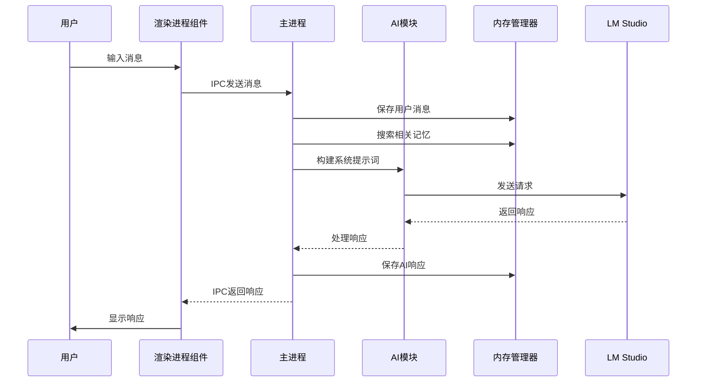
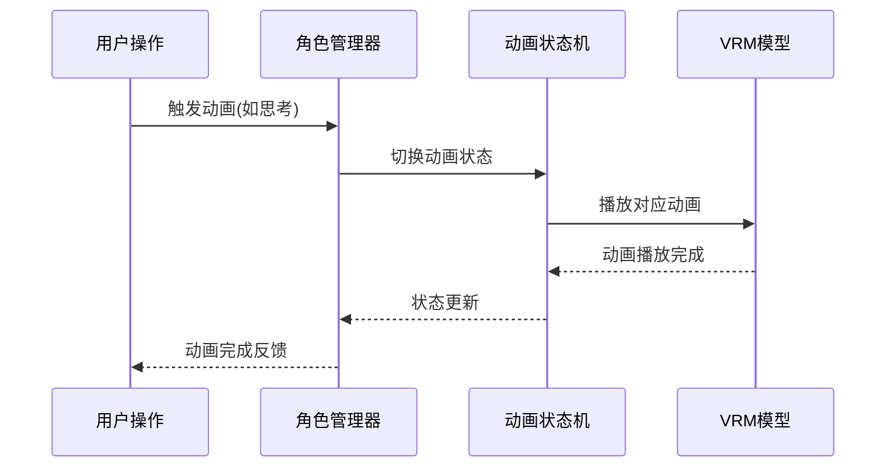

# 项目架构说明

本文档详细描述了AI Companion项目的整体架构设计、模块划分和数据流。

## 整体架构

AI Companion采用Electron框架构建，使用主进程-渲染进程的经典架构模式。项目采用模块化设计，将功能划分为多个独立的模块，便于维护和扩展。

### 架构图

```
┌─────────────────────────────────────────────────────────────┐
│                        Main Process                         │
├─────────────────────────────────────────────────────────────┤
│  ┌─────────────┐    ┌──────────────┐    ┌────────────────┐  │
│  │   Memory    │◄──►│     AI       │◄──►│   IPC Main     │  │
│  │  Manager    │    │   Module     │    │   Handler      │  │
│  └─────────────┘    └──────────────┘    └────────────────┘  │
│                                  │                          │
│                                  ▼                          │
│                       ┌──────────────────┐                 │
│                       │   HTTP Client    │                 │
│                       │  (LM Studio)     │                 │
│                       └──────────────────┘                 │
└─────────────────────────────────────────────────────────────┘
                                   │
                                   ▼
┌─────────────────────────────────────────────────────────────┐
│                      Renderer Process                       │
├─────────────────────────────────────────────────────────────┤
│  ┌─────────────┐    ┌──────────────┐    ┌────────────────┐  │
│  │   Chat      │    │   Window     │    │   Character    │  │
│  │ Component   │    │   Controls   │    │   Manager      │  │
│  └─────────────┘    └──────────────┘    └────────────────┘  │
│           │                 │                    │          │
│           ▼                 ▼                    ▼          │
│  ┌─────────────────────────────────────────────────────────┐│
│  │                   Three.js Engine                       ││
│  │  ┌─────────────┐  ┌────────────┐  ┌──────────────────┐  ││
│  │  │   Scene     │  │  Camera    │  │   Renderer       │  ││
│  │  └─────────────┘  └────────────┘  └──────────────────┘  ││
│  │  ┌─────────────────────────────────────────────────────┐││
│  │  │                 VRM Model                           │││
│  │  └─────────────────────────────────────────────────────┘││
│  └─────────────────────────────────────────────────────────┘│
└─────────────────────────────────────────────────────────────┘
```

## 模块设计

### 1. 核心模块 (src/core/)

#### 1.1 AI模块 (src/core/ai/)
负责与LM Studio API的交互，处理自然语言请求和响应。

- **主要功能**:
  - 发送用户消息到LM Studio
  - 接收并处理AI响应
  - 错误处理和重试机制

#### 1.2 动画模块 (src/core/animation/)
管理3D角色的动画状态机。

- **主要组件**:
  - AnimationStateMachine: 动画状态管理器
  - 各种动画状态实现(待机、思考、情感表达等)

#### 1.3 角色模块 (src/core/character/)
负责3D角色的加载、渲染和控制。

- **主要功能**:
  - VRM模型加载
  - Three.js场景设置
  - 角色动画播放
  - 用户交互处理

#### 1.4 内存模块 (src/core/memory/)
实现记忆存储和检索功能，支持多种存储后端。

- **架构模式**: 策略模式 + 工厂模式
- **支持的存储后端**:
  - Qdrant向量数据库
  - ChromaDB向量数据库
  - 内存存储(降级方案)

- **核心组件**:
  - MemoryManager: 抽象基类，定义接口
  - MemoryManagerFactory: 工厂类，创建具体实现
  - QdrantStrategy: Qdrant存储策略
  - ChromaDBStrategy: ChromaDB存储策略

### 2. 主进程模块 (src/main/)

#### 2.1 应用管理
- 窗口创建和管理
- 应用生命周期控制
- 系统托盘集成

#### 2.2 IPC通信
- 处理渲染进程发送的消息
- 调用核心模块功能
- 返回处理结果给渲染进程

#### 2.3 内存管理初始化
- 初始化内存管理器
- 处理存储后端的自动降级

### 3. 渲染进程模块 (src/renderer/)

#### 3.1 组件系统 (src/renderer/components/)
- App: 应用根组件
- ChatContainer: 聊天界面管理
- WindowControls: 窗口控制组件
- CharacterManager: 角色管理组件

#### 3.2 3D引擎集成
- Three.js场景初始化
- VRM模型加载和渲染
- 动画播放控制

### 4. 配置模块 (src/config/)
- 应用配置管理
- LM Studio API配置
- 系统提示词配置

### 5. UI组件 (src/ui/)
- 可复用的UI组件
- 样式文件

## 数据流

### 1. 用户消息处理流程



### 2. 3D角色动画控制流程



## 技术栈

- **主框架**: Electron
- **3D引擎**: Three.js
- **模型格式**: VRM (Virtual Reality Model)
- **向量数据库**: Qdrant
- **AI服务**: LM Studio (本地部署)
- **包管理**: npm
- **模块系统**: ES Modules

## 扩展性设计

### 1. 插件化架构
- 内存管理采用策略模式，支持添加新的存储后端
- 动画系统支持添加新的动画状态
- AI模块可扩展支持其他AI服务提供商

### 2. 配置驱动
- 通过配置文件管理应用行为
- 支持运行时配置更新

### 3. 模块解耦
- 各模块通过明确定义的接口交互
- 降低模块间的耦合度

## 性能优化

### 1. 内存管理
- 使用向量数据库优化记忆检索
- 实现智能缓存机制
- 支持内存降级方案

### 2. 3D渲染优化
- 使用Three.js最佳实践
- VRM模型优化加载
- 动画系统性能优化

### 3. 网络请求优化
- 实现请求重试机制
- 添加超时控制
- 错误处理和降级

## 安全设计

### 1. 数据安全
- 用户对话历史存储在本地
- 支持数据加密存储
- 提供数据清除功能

### 2. 网络安全
- 本地AI服务避免网络传输
- IPC通信安全验证
- 防止恶意输入攻击

## 部署架构

### 1. 开发环境
- 本地运行Electron应用
- Docker容器运行Qdrant数据库
- LM Studio本地部署AI模型

### 2. 生产环境
- 打包为可执行文件
- 支持Windows、macOS和Linux
- 可选的云端部署方案