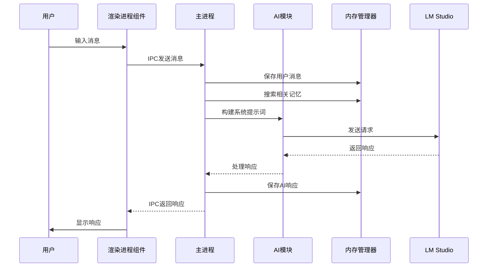
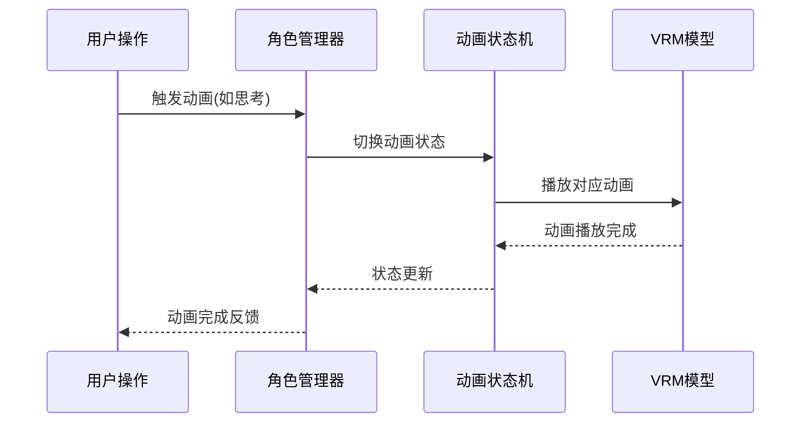

# Desktop Chatter 项目架构说明

本文档详细描述了Desktop Chatter项目的整体架构设计、模块划分和数据流。

> **更新说明**: 本文档已更新至v1.1.0版本，反映了最新的服务化架构和结构优化。

## 整体架构

Desktop Chatter采用Electron框架构建，使用主进程-渲染进程的经典架构模式。项目采用**服务化模块设计**，将功能划分为多个独立的服务和组件，具有高度的可维护性和扩展性。

### 🏗️ 架构特点

- **服务化架构**: 主进程采用微服务设计模式
- **组件化UI**: 渲染进程使用可复用组件架构
- **统一错误处理**: 完整的错误分类和恢复机制
- **结构化日志**: 分级日志系统和上下文追踪
- **类型安全**: 完善的JSDoc类型定义
- **配置驱动**: 模块化配置管理

### 🏗️ 服务化架构图

```
┌─────────────────────────────────────────────────────────────────────────────┐
│                              Main Process (服务化架构)                        │
├─────────────────────────────────────────────────────────────────────────────┤
│  ┌─────────────┐  ┌─────────────┐  ┌─────────────┐  ┌─────────────────────┐  │
│  │   Memory    │  │     AI      │  │   Window    │  │       IPC           │  │
│  │   Service   │  │   Service   │  │   Service   │  │     Service         │  │
│  └─────────────┘  └─────────────┘  └─────────────┘  └─────────────────────┘  │
│         │                 │                 │                 │              │
│         ▼                 ▼                 ▼                 ▼              │
│  ┌─────────────┐  ┌─────────────┐  ┌─────────────┐  ┌─────────────────────┐  │
│  │   Qdrant    │  │ LM Studio   │  │  Electron   │  │    Event Bus        │  │
│  │  Database   │  │    API      │  │   Window    │  │   (IPC Channel)     │  │
│  └─────────────┘  └─────────────┘  └─────────────┘  └─────────────────────┘  │
│                                                                              │
│  ┌─────────────────────────────────────────────────────────────────────────┐ │
│  │                        Utils Layer                                      │ │
│  │  ┌─────────────┐  ┌─────────────┐  ┌─────────────┐  ┌─────────────────┐ │ │
│  │  │   Logger    │  │    Error    │  │    Type     │  │   Config        │ │ │
│  │  │   System    │  │   Handler   │  │ Definitions │  │   Manager       │ │ │
│  │  └─────────────┘  └─────────────┘  └─────────────┘  └─────────────────┘ │ │
│  └─────────────────────────────────────────────────────────────────────────┘ │
└─────────────────────────────────────────────────────────────────────────────┘
                                        │
                                        ▼ (IPC Communication)
┌─────────────────────────────────────────────────────────────────────────────┐
│                           Renderer Process (组件化架构)                       │
├─────────────────────────────────────────────────────────────────────────────┤
│  ┌─────────────┐  ┌─────────────┐  ┌─────────────┐  ┌─────────────────────┐  │
│  │   Message   │  │    Input    │  │   Window    │  │     Character       │  │
│  │   Manager   │  │   Manager   │  │  Controls   │  │     Manager         │  │
│  └─────────────┘  └─────────────┘  └─────────────┘  └─────────────────────┘  │
│         │                 │                 │                 │              │
│         ▼                 ▼                 ▼                 ▼              │
│  ┌─────────────────────────────────────────────────────────────────────────┐ │
│  │                        Chat Container                                   │ │
│  │  ┌─────────────┐  ┌─────────────┐  ┌─────────────┐  ┌─────────────────┐ │ │
│  │  │  Message    │  │   Input     │  │  Animation  │  │      UI         │ │ │
│  │  │  Display    │  │ Validation  │  │   Control   │  │   Components    │ │ │
│  │  └─────────────┘  └─────────────┘  └─────────────┘  └─────────────────┘ │ │
│  └─────────────────────────────────────────────────────────────────────────┘ │
│                                        │                                     │
│                                        ▼                                     │
│  ┌─────────────────────────────────────────────────────────────────────────┐ │
│  │                         Three.js Engine                                 │ │
│  │  ┌─────────────┐  ┌─────────────┐  ┌─────────────┐  ┌─────────────────┐ │ │
│  │  │    Scene    │  │   Camera    │  │  Renderer   │  │   Animation     │ │ │
│  │  │   Manager   │  │   Control   │  │   Engine    │  │ State Machine   │ │ │
│  │  └─────────────┘  └─────────────┘  └─────────────┘  └─────────────────┘ │ │
│  │  ┌─────────────────────────────────────────────────────────────────────┐ │ │
│  │  │                          VRM Character Model                        │ │ │
│  │  └─────────────────────────────────────────────────────────────────────┘ │ │
│  └─────────────────────────────────────────────────────────────────────────┘ │
└─────────────────────────────────────────────────────────────────────────────┘
```

## 🔧 模块设计

### 1. 核心模块 (src/core/)

#### 1.1 动画系统 (src/core/animation/)
基于状态机的3D角色动画管理系统。

- **核心组件**:
  - `AnimationStateMachine`: 动画状态管理器，支持状态转换和混合
  - 状态定义: idle、thinking、joy、sad等情感状态
  - 自动转换机制和过渡动画

- **特性**:
  - 支持循环和非循环动画
  - 自动状态转换和延迟控制
  - 完整的JSDoc类型定义

#### 1.2 角色管理 (src/core/character/)
负责3D角色的加载、渲染和控制。

- **主要功能**:
  - VRM模型加载和初始化
  - Three.js场景设置和管理
  - 角色动画播放控制
  - 用户交互处理

- **组件**:
  - `CharacterContainer`: 角色容器管理
  - 场景初始化和渲染循环
  - 动画状态机集成

#### 1.3 智能记忆系统 (src/core/memory/)
实现记忆存储和检索功能，支持自动降级机制。

- **架构模式**: 策略模式 + 工厂模式 + 自动降级
- **支持的存储后端**:
  - ChromaDB向量数据库 (主要)
  - 内存存储 (降级方案)

- **核心组件**:
  - `MemoryManager`: 抽象基类，定义统一接口
  - `MemoryManagerFactory`: 工厂类，自动选择最佳策略
  - `ChromaDBStrategy`: ChromaDB存储策略实现
  - `MemoryStrategy`: 内存存储降级实现

### 2. 主进程服务化架构 (src/main/)

#### 2.1 AI服务 (src/main/services/aiService.js)
负责与LM Studio API的交互和AI响应处理。

- **核心功能**:
  - LM Studio API集成和请求处理
  - 系统提示词构建和记忆集成
  - 响应内容处理和清理
  - 智能错误处理和用户友好消息

- **错误处理**:
  - 网络连接错误自动重试
  - API响应验证和格式检查
  - 详细的错误分类和日志记录

#### 2.2 窗口服务 (src/main/services/windowService.js)
管理Electron窗口的创建、配置和控制。

- **窗口管理**:
  - 主窗口创建和配置
  - 窗口状态控制（最小化、最大化、关闭）
  - 窗口可见性和置顶控制

- **配置集成**:
  - 使用统一的窗口配置
  - 支持开发环境调试工具
  - @electron/remote模块集成

#### 2.3 IPC通信服务 (src/main/services/ipcService.js)
处理主进程与渲染进程之间的通信。

- **消息处理**:
  - 用户消息转发和AI响应返回
  - 窗口控制命令处理
  - 应用状态查询接口

- **事件管理**:
  - 统一的事件监听器设置
  - 自动清理和资源管理
  - 错误处理和日志记录

#### 2.4 内存服务 (src/main/services/memoryService.js)
封装内存管理器的初始化和操作。

- **初始化策略**:
  - 自动降级机制（Qdrant → ChromaDB → Memory）
  - 错误处理和状态监控
  - 服务可用性检查

- **操作接口**:
  - 记忆保存和搜索
  - 最近记忆获取
  - 记忆清理和管理

### 3. 渲染进程组件化架构 (src/renderer/)

#### 3.1 核心组件 (src/renderer/components/)

**App组件** - 应用根组件
- 整合所有子组件
- 管理全局状态和事件
- IPC通信协调

**ChatContainer组件** - 聊天容器
- 整合消息管理和输入管理
- 协调角色动画和AI响应
- 用户交互流程控制

**MessageManager组件** - 消息管理
- 消息显示和存储
- 支持用户、AI、系统消息类型
- 自动滚动和历史管理

**InputManager组件** - 输入管理
- 用户输入处理和验证
- 输入历史记录（支持上下箭头导航）
- 输入状态管理（处理中、可用等）

**CharacterManager组件** - 角色管理
- 3D角色初始化和控制
- 动画播放和状态管理
- Three.js引擎集成

**WindowControls组件** - 窗口控制
- 窗口操作按钮
- 系统集成功能

#### 3.2 3D引擎集成
- Three.js场景初始化和管理
- VRM模型加载和渲染优化
- 动画状态机集成
- 性能优化和资源管理

### 4. 配置模块重构 (src/config/)

#### 4.1 模块化配置
- `aiConfig.js`: AI服务专用配置
- `uiConfig.js`: UI主题和窗口配置
- `animationConfig.js`: 动画资源和事件配置
- `appConfig.js`: 统一配置导出（向后兼容）

#### 4.2 配置特性
- 完整的JSDoc类型定义
- 环境变量支持
- 配置验证和默认值
- 模块化导入导出

### 5. UI组件库 (src/ui/)
- 可复用的UI组件
- 统一的样式系统
- 组件文档和示例

### 6. 工具模块 (src/utils/)

#### 6.1 日志系统 (src/utils/logger.js)
- 分级日志记录（DEBUG、INFO、WARN、ERROR）
- 颜色编码输出
- 结构化日志格式
- 模块化日志器创建

#### 6.2 错误处理系统 (src/utils/errorHandler.js)
- 统一错误分类和处理
- 自动错误恢复机制
- 全局错误捕获
- 用户友好错误消息

#### 6.3 类型定义 (src/types/)
- TypeScript风格的类型定义
- JSDoc注释支持
- IDE智能提示增强

## 数据流

### 1. 用户消息处理流程



### 2. 3D角色动画控制流程



## 技术栈

- **主框架**: Electron
- **3D引擎**: Three.js
- **模型格式**: VRM (Virtual Reality Model)
- **向量数据库**: ChromaDB
- **AI服务**: LM Studio (本地部署)
- **包管理**: npm
- **模块系统**: ES Modules

## 扩展性设计

### 1. 插件化架构
- 内存管理采用策略模式，支持添加新的存储后端
- 动画系统支持添加新的动画状态
- AI模块可扩展支持其他AI服务提供商

### 2. 配置驱动
- 通过配置文件管理应用行为
- 支持运行时配置更新

### 3. 模块解耦
- 各模块通过明确定义的接口交互
- 降低模块间的耦合度

## 性能优化

### 1. 内存管理
- 使用向量数据库优化记忆检索
- 实现智能缓存机制
- 支持内存降级方案

### 2. 3D渲染优化
- 使用Three.js最佳实践
- VRM模型优化加载
- 动画系统性能优化

### 3. 网络请求优化
- 实现请求重试机制
- 添加超时控制
- 错误处理和降级

## 安全设计

### 1. 数据安全
- 用户对话历史存储在本地
- 支持数据加密存储
- 提供数据清除功能

### 2. 网络安全
- 本地AI服务避免网络传输
- IPC通信安全验证
- 防止恶意输入攻击

## 部署架构

### 1. 开发环境
- 本地运行Electron应用
- ChromaDB本地服务
- LM Studio本地部署AI模型

### 2. 生产环境
- 打包为可执行文件
- 支持Windows、macOS和Linux
- 可选的云端部署方案